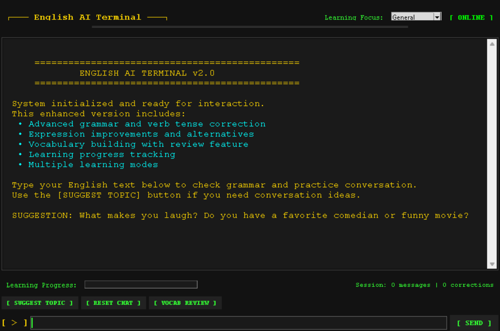

# English AI Terminal

A desktop application for English language learning using local AI models with Ollama.


## Features

### Core Functionality
- **Grammar correction**: Identifies and corrects grammar mistakes in real-time
- **Verb tense improvements**: Special focus on verb tense consistency and usage
- **Expression enhancement**: Suggests more natural and idiomatic expressions
- **Conversational practice**: Natural dialogue with AI to improve fluency
- **Learning progress tracking**: Monitor your improvement over time

### Enhanced UI
- Terminal-style interface with retro aesthetics
- Color-coded feedback for different types of corrections
- Progress tracking and session statistics
- Multiple learning modes for focused practice

### Learning Tools
- **Vocabulary Builder**: Creates a personalized vocabulary list from your conversations
- **Topic Suggestions**: Always have something to talk about
- **Learning Tips**: Contextual explanations for corrections
- **Multiple Learning Modes**: Focus on different aspects of language learning
- **Expression Alternatives**: Learn more natural ways to express yourself

## Installation

### Prerequisites
- Python 3.8+
- [Ollama](https://ollama.ai/) installed locally
- Language model downloaded in Ollama (default: gemma:2b)

### Setup

1. Clone this repository:
```bash
git clone https://github.com/joackoodeg/english_ai.git
cd english_ai
```

2. Create a virtual environment and activate it:
```bash
python -m venv venv
# On Windows:
venv\Scripts\activate
# On macOS/Linux:
source venv/bin/activate
```

3. Install dependencies:
```bash
pip install -r requirements.txt
```

4. Make sure Ollama is running with the required model:
```bash
ollama run gemma:2b
```

5. Launch the application:
```bash
python main.py
```

## Configuration

You can customize the application by editing the `config.py` file:

- Change the Ollama model (`OLLAMA_MODEL`)
- Modify UI appearance (colors, fonts, etc.)
- Enable/disable specific learning features
- Adjust learning levels and focus areas

## Usage

1. **Starting a conversation**: Just type in the input field and press Enter
2. **Getting suggestions**: Click the [SUGGEST TOPIC] button for conversation ideas
3. **Checking grammar**: Your text is automatically checked with each message
4. **Reviewing vocabulary**: Use the [VOCAB REVIEW] button to see words you've learned
5. **Changing focus**: Select different learning modes from the dropdown menu
6. **Tracking progress**: Watch your learning progress bar and session statistics

## Development

### Project Structure

```
english_ai/
├── assets/               # Static resources
│   └── starters.txt      # Conversation starter prompts
├── core/                 # Core functionality
│   ├── __init__.py       
│   ├── enhanced_grammar_checker.py   # Grammar analysis and correction
│   ├── improved_chat_manager.py      # Handles conversation logic
│   ├── enhanced_ollama_client.py     # Communicates with Ollama API
│   └── prompt_loader.py    # Loads conversation starters
├── ui/                   # User interface components
│   ├── __init__.py
│   └── enhanced_app_window.py     # Main application window
├── .gitignore            # Git ignore file
├── config.py             # Application configuration
├── main.py               # Application entry point
├── README.md             # This documentation
└── requirements.txt      # Python dependencies
```

### Adding New Features

- **Custom grammar rules**: Edit `enhanced_grammar_checker.py`
- **UI modifications**: Modify `enhanced_app_window.py`
- **New conversation starters**: Add to `assets/starters.txt`
- **AI response behavior**: Update `enhanced_ollama_client.py`

## License

This project is licensed under the MIT License - see the LICENSE file for details.

## Acknowledgments

- Ollama for providing local access to language models
- Language Tool Python for grammar checking capabilities
- The Python and Tkinter communities for building tools that make this possible